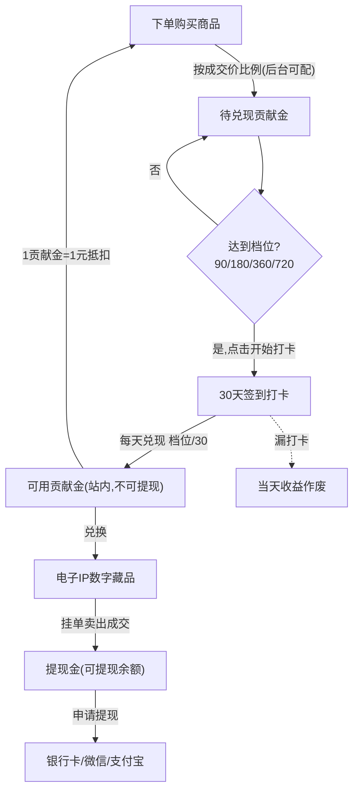
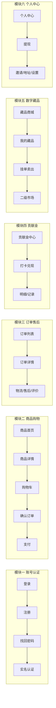
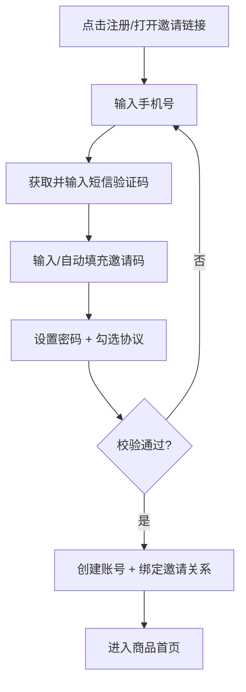
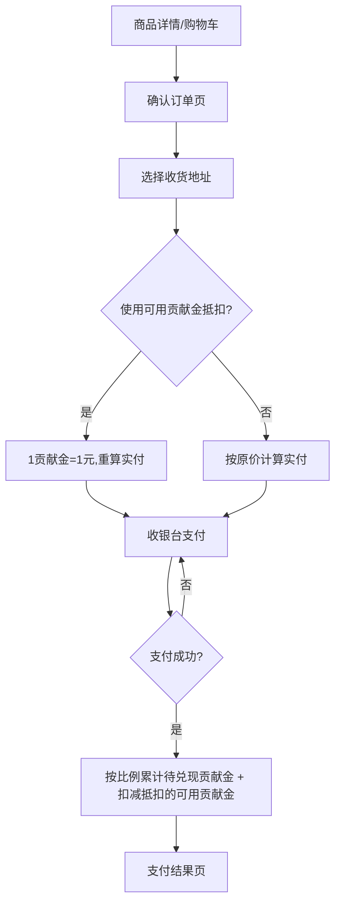
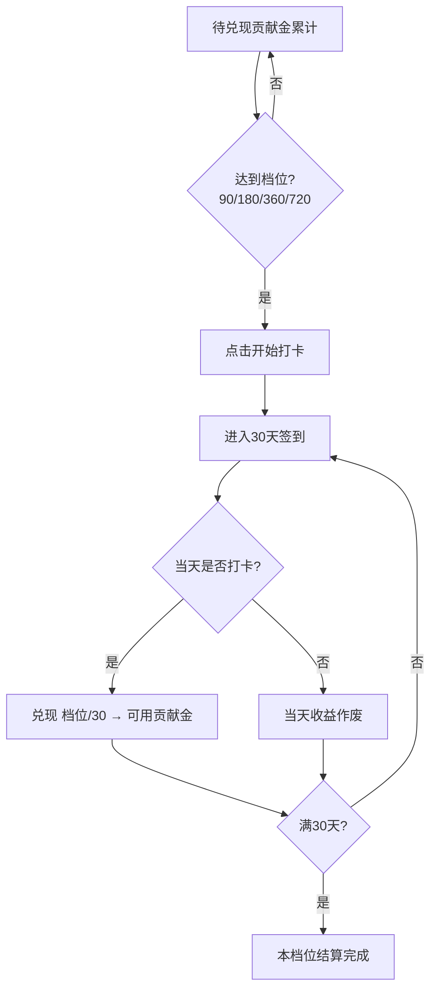

# 移动端 H5 商城 · 完整页面清单与功能拆解文档

> 版本：v1.0　|　适用端：移动端 H5　|　文档性质：产品规划（不含代码）

---

## 一、业务模型概述

本项目是一个移动端 H5 商城，在常规电商「浏览 → 下单 → 支付 → 履约」链路之上，叠加了一套「贡献金 + 数字藏品 + 提现」的激励与流转体系：

1. 用户购买商品后，按成交价的一定比例（后台可配）累计「贡献金」。
2. 贡献金分 4 个档位（90 / 180 / 360 / 720），累计达到某档位后，用户可发起「打卡兑现」，分 30 天平均签到兑现，漏卡则当天收益作废。
3. 兑现后的「可用贡献金」可用于下单抵扣（1 贡献金 = 1 元），或兑换「电子 IP 数字藏品」。
4. 数字藏品可在二级市场挂单卖出，成交所得计入「提现金」，可申请提现到银行卡 / 微信 / 支付宝。
5. 注册支持邀请码机制 + 手机号短信验证；登录支持账号密码 / 短信验证码。

### 业务全链路图

---

## 二、核心名词与规则约定

### 2.1 三类资产（务必区分）

| 资产 | 来源 | 用途 | 是否可提现 |
| --- | --- | --- | --- |
| 待兑现贡献金 | 购物按成交价比例累计（后台可配比例） | 达档位后通过打卡兑现转为「可用贡献金」 | 否（需先兑现） |
| 可用贡献金 | 打卡兑现得到，1 贡献金 = 1 元 | ① 下单抵扣价格；② 兑换数字藏品 | 否（仅站内消费） |
| 提现金 | 数字藏品二级市场成交所得 | 申请提现到银行卡 / 微信 / 支付宝 | 是 |

### 2.2 档位与打卡兑现规则

- 档位：90 / 180 / 360 / 720（单位：贡献金）。
- 当「待兑现贡献金」累计达到某一档位，用户可在该档位发起「开始打卡」。
- 打卡周期为 30 天，每天兑现金额 = 档位金额 / 30（例如 90 档每天兑现 3）。
- 当天完成签到打卡 → 当天兑现额计入「可用贡献金」；漏打卡 → 当天该笔收益作废，不可补签（规则以后台配置为准）。
- 30 天结束后该档位打卡结算完成。

### 2.3 账号规则

- 注册：手机号 + 短信验证码 + 邀请码（邀请码是否必填由后台配置）。
- 登录：① 账号（手机号）+ 密码；② 手机号 + 短信验证码。
- 涉及提现 / 数字藏品，建议要求实名认证（KYC）。

---

## 三、完整页面清单（模块总览）

下文按模块逐页拆解。每个页面统一从「用途 / 入口 / 核心模块 / 功能点 / 关键字段 / 业务关联」六个维度描述。

---

## 模块一　账号与认证

### 1.1 启动 / 引导页
- 用途：App 首次进入的品牌展示与引导。
- 入口：打开 H5 链接首次进入。
- 核心模块：Logo、广告位、跳过按钮、引导轮播（首次）。
- 功能点：倒计时跳转；已登录直达首页，未登录进入登录页。
- 关键字段：是否首次访问标记。

### 1.2 登录页
- 用途：用户登录入口。
- 入口：启动页 / 个人中心未登录态 / 需登录的操作拦截。
- 核心模块：登录方式切换（账密 / 短信）、手机号输入、密码输入、验证码输入、获取验证码按钮、登录按钮、注册入口、忘记密码入口、第三方登录（可选）、协议勾选。
- 功能点：
  - 账号密码登录；
  - 手机号 + 短信验证码登录；
  - 短信验证码 60s 倒计时与防刷（图形验证码 / 滑块）；
  - 登录态保存（Token）。
- 关键字段：手机号、密码、验证码、邀请来源。
- 业务关联：登录后拉取三类资产余额。

### 1.3 短信验证码页（可与登录/注册合并为弹层）
- 用途：输入 6 位短信验证码完成校验。
- 功能点：验证码自动聚焦、倒计时重发、错误提示、超时失效。

### 1.4 注册页
- 用途：新用户注册。
- 入口：登录页注册按钮 / 邀请链接（带邀请码自动填充）。
- 核心模块：手机号、短信验证码、设置密码、邀请码输入框、协议勾选、注册按钮。
- 功能点：
  - 手机号短信验证；
  - 邀请码校验（来自链接自动填充并可只读 / 手动输入）；
  - 注册成功建立邀请绑定关系。
- 关键字段：手机号、验证码、密码、邀请码、设备信息。
- 业务关联：邀请关系决定后续邀请奖励统计。

### 1.5 忘记 / 重置密码页
- 用途：通过短信验证重置登录密码。
- 功能点：手机号 → 短信验证码 → 设置新密码。

### 1.6 实名认证页（KYC）
- 用途：提现与数字藏品交易前的实名校验。
- 核心模块：真实姓名、身份证号、（可选）人脸识别 / 证件上传。
- 功能点：实名提交、认证状态展示（未认证 / 审核中 / 已认证）。
- 业务关联：提现页、藏品挂单需校验实名状态。

### 1.7 协议页
- 用途：展示用户协议、隐私政策、数字藏品交易规则等。

---

## 模块二　商品与购物

### 2.1 商品首页
- 用途：商城主入口，商品聚合展示。
- 入口：底部 Tab 首页。
- 核心模块：
  - 顶部栏：搜索栏、订单入口按钮、购物车按钮（带角标）；
  - 轮播广告模块（Banner）；
  - 商品分类模块（金刚区 / 分类导航）；
  - 商品卡片列表模块（商品图、名称、价格、可获贡献金、销量标签）；
  - 底部 Tab 导航。
- 功能点：下拉刷新、上拉加载更多、分类筛选、商品点击进详情、加入购物车。
- 关键字段：商品 ID、名称、主图、售价、贡献金比例 / 预计贡献金、销量。
- 业务关联：每个商品卡片需展示「可获贡献金」（= 成交价 × 后台配置比例）。

### 2.2 搜索页
- 用途：关键词搜索商品。
- 核心模块：搜索输入框、历史搜索、热门搜索、搜索结果列表、筛选/排序。
- 功能点：历史记录管理、联想词、按价格/销量排序、结果空状态。

### 2.3 分类列表页
- 用途：按分类浏览商品。
- 核心模块：左侧一级分类、右侧二级分类与商品列表。

### 2.4 商品详情页
- 用途：展示商品完整信息并支持下单。
- 入口：首页 / 搜索 / 分类 / 分享链接。
- 核心模块：
  - 商品图片轮播；
  - 价格区（售价、划线价、可获贡献金、是否支持贡献金抵扣）；
  - 收货地址展示（默认地址 / 配送说明）；
  - 实时下单动态滚动条（上下滚动展示「xxx 用户刚刚下单了 xxx」）；
  - 商品参数 / 详情图文；
  - 评价模块入口；
  - 底部操作栏：客服、购物车、加入购物车、立即购买。
- 功能点：规格选择（SKU）、数量选择、加入购物车、立即购买、收藏、分享。
- 关键字段：商品 ID、SKU、库存、售价、贡献金比例、详情富文本、实时订单流数据。
- 业务关联：详情页明确展示本单可累计的「待兑现贡献金」。

### 2.5 购物车页
- 用途：管理已加入商品并结算。
- 核心模块：商品列表（选择、增减数量、删除）、全选、合计金额、预计可获贡献金、去结算。
- 功能点：失效商品处理、批量删除、金额实时计算。

### 2.6 确认订单页（下单页）
- 用途：提交订单前确认信息。
- 核心模块：
  - 收货地址选择；
  - 商品清单；
  - 贡献金抵扣开关（输入/勾选使用可用贡献金，1 贡献金 = 1 元，展示可抵扣上限）；
  - 优惠券（可选）；
  - 金额明细（商品总额、贡献金抵扣、运费、实付）；
  - 预计本单可获「待兑现贡献金」；
  - 提交订单按钮。
- 功能点：地址切换、抵扣实时重算、库存校验、下单提交。
- 业务关联：抵扣消耗「可用贡献金」；下单成功后按比例累计「待兑现贡献金」。

### 2.7 收银台 / 支付页
- 用途：选择支付方式并完成支付。
- 核心模块：支付方式（微信 / 支付宝 / 余额等）、待支付金额、支付倒计时。
- 功能点：调起支付、支付结果轮询。

### 2.8 支付结果页
- 用途：展示支付成功 / 失败。
- 功能点：成功后展示本单累计贡献金、查看订单、继续购物；失败后重新支付。

---

## 模块三　订单与售后

### 3.1 订单列表页
- 用途：查看各状态订单。
- 入口：首页订单按钮 / 个人中心「我的订单」。
- 核心模块：状态 Tab（全部 / 待付款 / 待发货 / 待收货 / 已完成 / 售后）、订单卡片、操作按钮。
- 功能点：去支付、提醒发货、确认收货、申请售后、再次购买、删除订单。
- 关键字段：订单号、状态、商品快照、金额、贡献金抵扣额、本单累计贡献金。

### 3.2 订单详情页
- 用途：单个订单完整信息。
- 核心模块：物流信息、收货地址、商品清单、金额明细（含贡献金抵扣 + 本单累计贡献金）、订单状态时间线、操作按钮、客服入口。

### 3.3 物流跟踪页
- 用途：展示配送轨迹。

### 3.4 售后 / 退款页
- 用途：申请与跟踪售后。
- 核心模块：售后类型（仅退款 / 退货退款）、原因、凭证上传、售后列表、售后详情、进度。
- 业务关联：退款需处理已使用贡献金的回退与已累计贡献金的冲销规则（后台配置）。

### 3.5 评价页
- 用途：对已完成订单评价。
- 核心模块：评分、文字、图片上传、匿名选项。

---

## 模块四　贡献金体系（核心）

### 4.1 贡献金中心 / 钱包页
- 用途：贡献金资产总览与入口聚合。
- 入口：个人中心贡献金区。
- 核心模块：
  - 待兑现贡献金总额；
  - 可用贡献金余额；
  - 四档位进度（90 / 180 / 360 / 720，展示当前累计与可发起打卡的档位）；
  - 入口：开始打卡 / 打卡兑现、贡献金明细、兑换藏品。
- 功能点：档位达标提示、发起打卡。
- 关键字段：待兑现额、可用额、各档位达标状态。

### 4.2 打卡兑现页
- 用途：发起并完成 30 天打卡兑现。
- 核心模块：
  - 当前打卡档位与总兑现额；
  - 每日可兑现金额（档位 / 30）；
  - 30 天签到进度（日历 / 进度条）；
  - 今日打卡按钮；
  - 已兑现 / 待兑现 / 已作废（漏卡）统计。
- 功能点：开始打卡、每日签到、漏卡当天收益作废提示、周期完成结算。
- 业务关联：兑现额实时累加到「可用贡献金」。

### 4.3 打卡日历 / 兑现记录页
- 用途：查看历史打卡与兑现明细。
- 核心模块：日历视图（已打卡 / 漏卡标记）、每日兑现金额记录。

### 4.4 贡献金明细页
- 用途：贡献金收支流水。
- 核心模块：明细列表（购物累计 / 打卡兑现 / 下单抵扣 / 兑换藏品消耗 / 售后冲销），按类型筛选。
- 关键字段：时间、类型、变动额、关联订单/藏品、变动后余额。

### 4.5 任务中心
- 用途：聚合可获取贡献金 / 奖励的任务。
- 核心模块：每日签到、邀请好友、首单任务、浏览/分享任务等任务列表与领取状态。
- 业务关联：任务奖励可发放贡献金（规则后台配置）。

---

## 模块五　数字藏品 / 电子 IP

### 5.1 藏品兑换商城页
- 用途：用「可用贡献金」兑换电子 IP 数字藏品。
- 核心模块：藏品列表（藏品图、名称、兑换所需贡献金、库存/限量）、分类筛选。
- 功能点：兑换、库存与限购校验。
- 业务关联：兑换消耗「可用贡献金」。

### 5.2 藏品详情页
- 用途：展示藏品详情并兑换。
- 核心模块：藏品大图 / 3D 展示、名称、发行方、限量信息、兑换所需贡献金、权益说明、兑换按钮、当前市场挂单参考价。

### 5.3 我的数字藏品页
- 用途：查看持有的藏品。
- 入口：个人中心「我的数字藏品」。
- 核心模块：持有藏品列表（藏品图、名称、持有数量 / 编号、状态：持有中 / 挂单中）。
- 功能点：进入持有详情、发起挂单。

### 5.4 持有藏品详情页
- 用途：单个持有藏品的详情与操作。
- 核心模块：藏品信息、唯一编号 / 链上信息（如有）、挂单卖出入口、转赠入口（可选）、流转记录。

### 5.5 挂单卖出页
- 用途：将持有藏品挂单到二级市场。
- 核心模块：藏品信息、设定售价、手续费预估、实际到账（提现金）预估、挂单确认。
- 功能点：价格区间校验、实名校验、挂单提交。
- 业务关联：成交后所得（扣除平台手续费，后台可配）计入「提现金」。

### 5.6 二级交易市场页
- 用途：浏览并购买他人挂单的藏品。
- 核心模块：在售藏品列表（藏品图、名称、价格、卖家）、筛选 / 排序、藏品行情、购买入口。
- 功能点：下单购买挂单藏品、成交。

### 5.7 我的挂单管理页
- 用途：管理自己发布的挂单。
- 核心模块：挂单列表（在售 / 已成交 / 已撤销）、改价、撤单。

### 5.8 交易记录页
- 用途：藏品买卖与兑换记录。
- 核心模块：记录列表（兑换 / 买入 / 卖出 / 成交所得入提现金），筛选。
- 关键字段：时间、类型、藏品、金额、手续费、提现金流向。

---

## 模块六　个人中心

### 6.1 个人中心首页
- 用途：用户中心总览与功能聚合。
- 入口：底部 Tab。
- 核心模块：
  - 用户信息区（头像、昵称、实名状态）；
  - 资产展示区：可用贡献金 + 提现金（提现金可点击进入提现页）+ 待兑现贡献金入口；
  - 功能宫格：任务中心、我的订单、我的数字藏品、基本信息；
  - 订单状态快捷入口（待付款 / 待发货 / 待收货 / 售后）；
  - 其他入口：我的邀请、收货地址、消息通知、设置、帮助客服。
- 业务关联：顶部同时清晰区分「可用贡献金（站内）」与「提现金（可提现）」。

### 6.2 提现页
- 用途：将「提现金」提现到第三方账户。
- 核心模块：可提现余额、提现金额输入、提现方式（银行卡 / 微信 / 支付宝）、手续费/到账说明、实名校验、提现记录入口、提交按钮。
- 功能点：金额校验（最小/最大、余额）、实名/绑卡校验、提现申请提交。
- 业务关联：仅「提现金」可提现，可用贡献金不可提现。

### 6.3 提现记录页
- 用途：查看历史提现申请与状态。
- 核心模块：记录列表（申请中 / 已到账 / 已驳回）、金额、方式、时间、失败原因。

### 6.4 基本信息编辑页
- 用途：编辑个人资料。
- 核心模块：头像、昵称、性别、生日、绑定手机号、修改密码入口。

### 6.5 收货地址管理页
- 用途：管理收货地址。
- 核心模块：地址列表、新增/编辑、设为默认、删除。

### 6.6 我的邀请页
- 用途：邀请好友与奖励统计。
- 核心模块：我的邀请码 / 邀请海报、分享按钮、已邀请人数与列表、邀请奖励记录。
- 业务关联：邀请奖励规则（贡献金 / 其他）后台配置。

### 6.7 消息通知页
- 用途：系统/订单/交易消息。
- 核心模块：消息分类列表、未读标记、详情。

### 6.8 设置页
- 用途：账号与系统设置。
- 核心模块：账号安全（改密、绑定）、实名认证入口、清除缓存、关于我们、协议、退出登录、注销账号。

### 6.9 帮助 / 客服页
- 用途：常见问题与在线客服。

---

## 模块七　通用 / 系统

- 在线客服页：常见问题 + 人工入口。
- 网络异常 / 错误页：断网、404、服务异常重试。
- 空状态规范：列表无数据（订单、藏品、明细、搜索结果等）统一占位与引导。
- 全局组件：顶部导航、底部 Tab、Toast / 弹窗、加载态、登录拦截、分享面板。

---

## 四、关键业务流程图

### 4.1 注册（邀请码 + 短信）流程

### 4.2 下单（含贡献金抵扣）支付流程

### 4.3 贡献金打卡兑现流程

---

## 五、后台可配置项清单（仅清单，不展开后台页面）

为支撑用户端业务，管理后台需支持以下可配置项：

- 贡献金比例：成交价累计贡献金的比例（可按全局 / 分类 / 单品配置）。
- 贡献金档位：90 / 180 / 360 / 720 档位数值与是否可调整。
- 打卡规则：打卡天数（默认 30）、漏卡规则（作废 / 可补签）、每日兑现算法。
- 抵扣规则：可用贡献金抵扣比例上限、是否与优惠券叠加。
- 邀请规则：邀请码是否必填、邀请奖励内容与发放规则。
- 短信配置：短信服务商、模板、频控/防刷策略。
- 数字藏品：藏品发行、兑换所需贡献金、限量/限购。
- 二级市场：是否开放交易、平台手续费比例、价格区间限制、是否需实名。
- 提现规则：提现方式、最小/最大额度、手续费、到账时效、是否需实名/绑卡。
- 售后规则：退款时贡献金的回退与累计冲销逻辑。
- 商品/分类/Banner：商品管理、分类管理、首页轮播与活动位。

---

## 六、说明

- 本文档仅聚焦用户端 H5 页面规划。管理后台以「可配置项清单」附带，未展开后台页面设计；如需可后续单独规划后台产品文档。
- 涉及金额、提现、数字藏品交易的合规要求（实名、风控、资金通道）需结合实际运营与监管政策落地。
