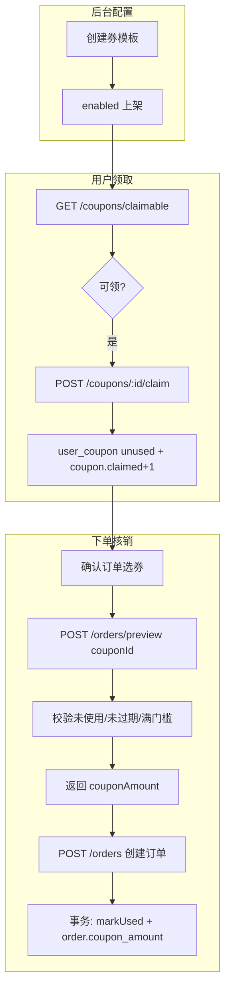

# 优惠券业务说明

> 版本：v1.0（2026-06-14）  
> 与当前代码实现对齐：`apps/server/src/modules/operations/coupon.service.ts`、`order.service.ts`；H5 `Coupons.vue`、`OrderConfirm.vue`；Admin `Coupons.vue`

---

## 一、业务概述

优惠券为 P2 运营能力，支持后台配置券模板、用户领取、下单时抵扣实付金额。与贡献金抵扣**可叠加**：先算贡献金抵扣，再算优惠券抵扣，最后加运费得出实付。

| 角色 | 能力 |
| --- | --- |
| 运营（Admin） | 创建/编辑券模板、上下架、查看领取/核销统计 |
| 用户（H5） | 领取可用券、确认订单时选择未使用券、下单核销 |
| 系统 | 试算校验、创建订单事务内标记已用、写 `order.coupon_amount` |

---

## 二、数据模型

迁移：`apps/server/migrations/007_operations.sql`

### 2.1 `coupon`（券模板）

| 字段 | 类型 | 说明 |
| --- | --- | --- |
| id | bigint PK | |
| name | string | 券名称，如「新人满50减5」 |
| type | enum | `fixed` 满减 / `discount` 折扣 |
| value | decimal | 满减金额；折扣为系数（0.9 = 9 折） |
| min_amount | decimal | 使用门槛（商品总额，不含运费） |
| total | int | 发放总量；0 表示不限量 |
| claimed | int | 已领取数 |
| used | int | 已核销数 |
| status | enum | `enabled` / `disabled` |
| start_at / end_at | datetime | 可领取/使用有效期（可空=不限） |

### 2.2 `user_coupon`（用户持券）

| 字段 | 类型 | 说明 |
| --- | --- | --- |
| id | bigint PK | 下单时传 `couponId` 即此 ID |
| user_id | bigint FK | |
| coupon_id | bigint FK | 关联券模板 |
| status | enum | `unused` / `used` / `expired` |
| order_id | bigint | 核销关联订单 |
| claimed_at / used_at | datetime | 领取/使用时间 |

**约束（业务层）**：同一用户对同一券模板仅可领取一次。

### 2.3 订单字段

`order.coupon_amount`：本单优惠券抵扣金额（元），与 `fund_deduct_amount` 并列写入订单。

---

## 三、券类型与抵扣计算

实现：`CouponService.calcDiscount`

| 类型 | 计算规则 | 示例 |
| --- | --- | --- |
| `fixed` | `min(value, 商品总额)` | 满 50 减 5，总额 80 → 抵 5 |
| `discount` | `商品总额 × (1 - value)`，保留两位小数 | 9 折券 value=0.9，总额 100 → 抵 10 |

**门槛校验**：`商品总额 >= coupon.min_amount`（试算/下单时服务端校验）。

**实付公式**（`order.service` 试算）：

```
payAmount = max(商品总额 - 贡献金抵扣 - 优惠券抵扣 + 运费, 0)
```

> 优惠券抵扣基数为**商品总额**（`totalAmount`），不含运费；贡献金抵扣与优惠券抵扣独立计算后一并扣减。

---

## 四、全链路流转



### 4.1 领取规则

- 券模板 `status = enabled`
- 在 `start_at` ~ `end_at` 有效期内
- `claimed < total`（`total = 0` 时不限量）
- 用户未领取过该模板
- 领取在事务内完成：`coupon.claimed += 1` + 插入 `user_coupon`

### 4.2 下单核销规则

- 入参 `couponId` 为 **`user_coupon.id`**（非券模板 id）
- 校验：`status = unused`、券模板仍 enabled 且在有效期、商品总额 ≥ 门槛
- 创建订单同一事务：`user_coupon.status → used`、写 `order_id`/`used_at`、`coupon.used += 1`
- 未支付订单关闭时**不自动回退券**（当前实现；售后退款亦不回退券）

### 4.3 与贡献金叠加

- 试算同时支持 `useFund` + `couponId`
- 贡献金抵扣上限仍按商品行 `deductLimitRate` 计算，与是否用券无关
- 产品文档中「是否与优惠券叠加」：**当前实现为允许叠加**

---

## 五、接口清单

### 5.1 用户端（需 JWT）

| 方法 | 路径 | 说明 |
| --- | --- | --- |
| GET | `/api/coupons/claimable` | 可领取列表，含 `claimed` 是否已领 |
| GET | `/api/coupons/mine` | 我的券（含模板信息、状态） |
| POST | `/api/coupons/:id/claim` | 领取，`id` 为券模板 id |
| POST | `/api/orders/preview` |  body 增 `couponId`（user_coupon.id） |
| POST | `/api/orders` |  body 增 `couponId`，创建时核销 |

### 5.2 后台（需 Admin JWT + `coupon:manage`）

| 方法 | 路径 | 说明 |
| --- | --- | --- |
| GET | `/api/admin/coupons` | 分页列表 |
| POST | `/api/admin/coupons` | 新增模板 |
| PUT | `/api/admin/coupons/:id` | 编辑 |
| POST | `/api/admin/coupons/:id/status` | 上下架 `{ status: enabled\|disabled }` |

---

## 六、前端页面与交互

### 6.1 H5

| 路由 | 页面 | 说明 |
| --- | --- | --- |
| `/mine/coupons` | 我的优惠券 | Tab：可领取 / 我的券；领取后刷新列表 |
| `/order/confirm` | 确认订单 | 优惠券行可点开选择；试算带 `couponId` |

**确认订单页刷新策略**（`OrderConfirm.vue`）：

- 全局 `keep-alive` 缓存页面，从领券页返回时 `onActivated` 触发
- `loadMyCoupons()`：拉取 `status=unused` 的持券
- 返回页面（`refreshOnReturn`）与点击选券（`openCouponPicker`）时均重新拉取，避免领券后列表仍显示「暂无可用」

### 6.2 Admin

| 路由 | 页面 | 权限 |
| --- | --- | --- |
| `/admin/coupons` | 优惠券管理 | `coupon:manage` |

支持新建/编辑：名称、类型、面额/折扣、门槛、总量、有效期、状态。

---

## 七、种子数据与验收

- 服务启动时若 `coupon` 表为空，自动 seed：
  - 「新人满50减5」：`fixed` 5 元，门槛 50
  - 「全场9折券」：`discount` 0.9，门槛 100
- 迁移：`007_operations.sql`（与活动/字典表同文件）
- 验收脚本：`scripts/m5-operations-acceptance.sh`（含领券、后台 CRUD、下单动态等 13 项）

---

## 八、关联文档

- 数据模型总表：[数据模型与接口字段清单.md](./数据模型与接口字段清单.md)
- 贡献金抵扣与叠加：[贡献金业务说明.md](./贡献金业务说明.md)
- 开发进度与验收记录：[开发进度.md](./开发进度.md)
