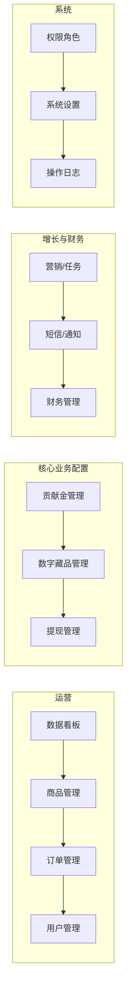
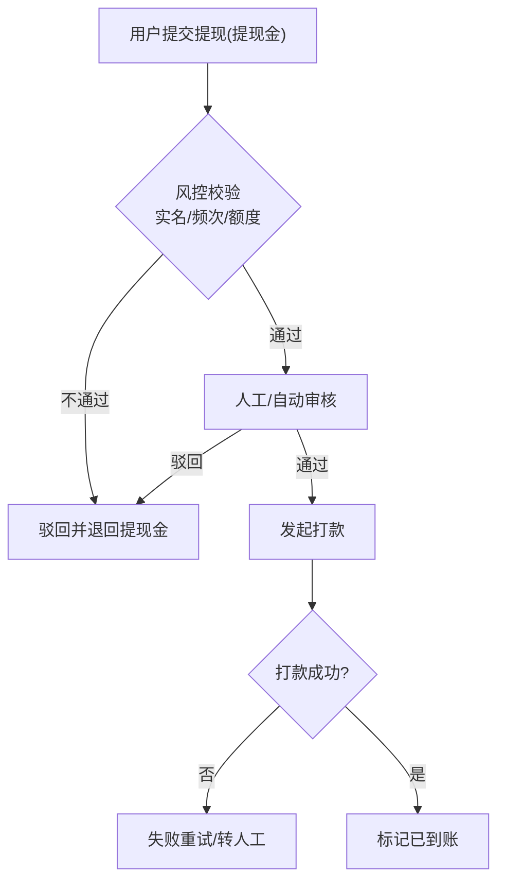
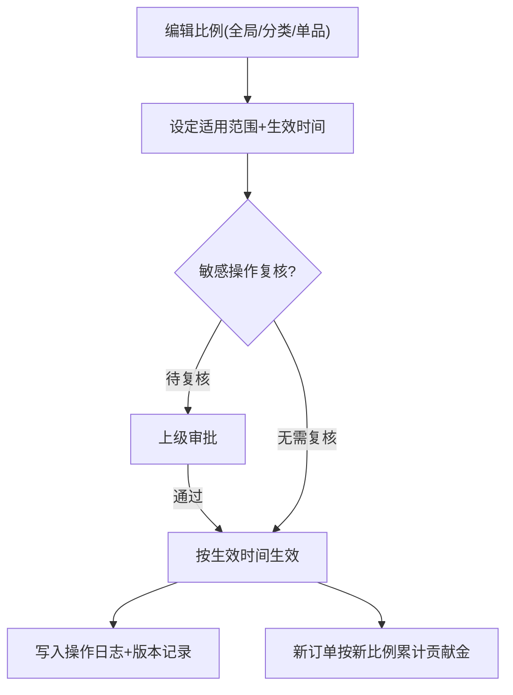
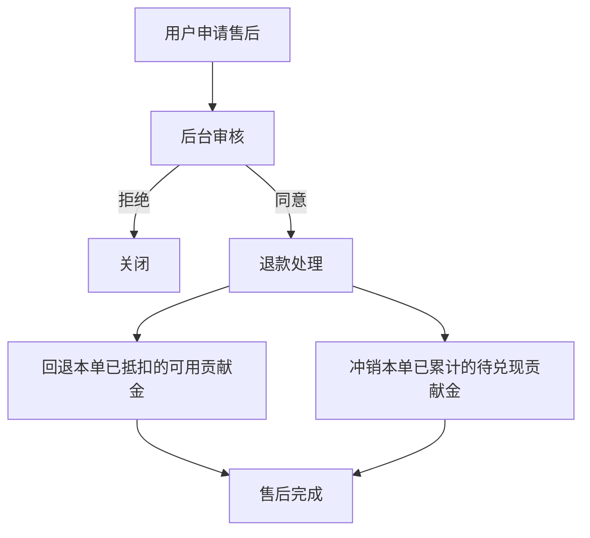

# 后台管理端 · 完整页面清单与功能拆解文档

> 版本：v1.0　|　适用端：PC Web 管理后台　|　配套文档：《产品页面清单与功能拆解.md》（用户端 H5）

---

## 一、概述

本后台为用户端 H5 商城的运营管理系统，核心目标是支撑以下业务的配置、审核与监控：

- 商品 / 订单 / 用户的基础运营管理。
- 贡献金体系（累计比例、档位、打卡规则、抵扣规则）的可配置化。
- 数字藏品的发行、兑换、二级市场与手续费管理。
- 提现的审核与财务对账（提现金）。
- 营销（邀请、任务、优惠券、活动位）与短信/通知管理。
- 权限、参数、操作日志等系统能力。

### 后台模块总览

> 每个页面统一从「用途 / 核心模块 / 功能点 / 关键字段 / 业务关联」维度拆解。

---

## 模块零　登录与权限基础

### 0.1 后台登录页
- 用途：管理员登录。
- 核心模块：账号、密码、图形验证码、（可选）二次验证 2FA。
- 功能点：登录、登录失败锁定、找回密码（管理员）。

### 0.2 角色管理页
- 用途：定义角色及其权限范围。
- 核心模块：角色列表、权限树（菜单 + 按钮 + 数据范围）、新增/编辑/删除角色。
- 关键字段：角色名、权限集合、数据权限范围。

### 0.3 管理员账号管理页
- 用途：管理后台员工账号。
- 核心模块：账号列表、分配角色、启用/禁用、重置密码。

### 0.4 操作日志页
- 用途：审计后台操作。
- 核心模块：操作人、模块、动作、IP、时间、详情，支持筛选导出。
- 业务关联：贡献金比例、提现审核等敏感操作必须留痕。

---

## 模块一　数据看板（Dashboard）

### 1.1 经营概览页
- 用途：核心经营指标总览。
- 核心模块：
  - 交易指标：GMV、订单数、客单价、支付成功率；
  - 用户指标：新增/活跃用户、邀请转化；
  - 贡献金指标：累计发放（待兑现）、已兑现、抵扣消耗、待打卡用户数；
  - 藏品/提现指标：藏品兑换量、二级市场成交额、待审核提现额；
  - 趋势图与时间筛选。
- 功能点：日期范围筛选、数据导出、下钻到明细。

---

## 模块二　商品管理

### 2.1 商品列表页
- 用途：管理全部商品。
- 核心模块：商品列表（图、名称、价格、库存、状态、贡献金比例）、筛选、批量上下架。
- 功能点：新增、编辑、上下架、删除、复制、排序/推荐。

### 2.2 商品编辑页
- 用途：编辑商品完整信息。
- 核心模块：
  - 基础信息（名称、分类、主图、轮播图、详情富文本）；
  - 价格与库存（SKU 规格、售价、划线价、库存）；
  - 贡献金配置（该商品累计贡献金比例，可覆盖全局默认）；
  - 是否支持贡献金抵扣、抵扣上限；
  - 运费模板、状态。
- 关键字段：商品 ID、SKU、价格、贡献金比例、抵扣开关。
- 业务关联：直接决定用户端「可获贡献金」与「抵扣」展示。

### 2.3 商品分类管理页
- 用途：维护分类树。
- 核心模块：多级分类、图标、排序、显示/隐藏。

### 2.4 首页轮播 / 活动位管理页
- 用途：配置首页 Banner、金刚区、活动位。
- 核心模块：广告位列表、图片、跳转链接、生效时间、排序。

### 2.5 实时下单动态配置页
- 用途：配置商品详情页「实时下单动态」滚动内容。
- 核心模块：真实订单流开关、虚拟/兜底文案规则、脱敏规则（用户名打码）。
- 业务关联：对应用户端详情页上下滚动动态。

### 2.6 评价管理页
- 用途：审核与管理商品评价。
- 核心模块：评价列表、审核（通过/隐藏）、回复、置顶。

---

## 模块三　订单管理

### 3.1 订单列表页
- 用途：管理全部订单。
- 核心模块：订单列表（订单号、用户、金额、贡献金抵扣额、累计贡献金、状态）、多条件筛选、导出。
- 功能点：查看、改价/备注、关闭订单、手动发货。

### 3.2 订单详情页
- 用途：单订单完整信息与操作。
- 核心模块：商品快照、金额明细（含抵扣与累计贡献金）、收货信息、状态时间线、物流、操作记录。

### 3.3 发货 / 物流管理页
- 用途：发货与物流单号维护。
- 核心模块：待发货列表、批量发货、物流公司与单号、轨迹同步。

### 3.4 售后管理页
- 用途：处理退款 / 退货售后。
- 核心模块：售后列表、审核（同意/拒绝）、退款处理、凭证查看。
- 业务关联：退款时按规则回退已抵扣的可用贡献金、冲销已累计的待兑现贡献金。

---

## 模块四　用户管理

### 4.1 用户列表页
- 用途：管理 C 端用户。
- 核心模块：用户列表（手机号、昵称、实名状态、注册时间、邀请人、三类资产余额）、筛选、导出。
- 功能点：查看详情、冻结/解冻、加入黑名单。

### 4.2 用户详情页
- 用途：单用户 360 视图。
- 核心模块：
  - 基础信息与实名状态；
  - 资产：待兑现贡献金 / 可用贡献金 / 提现金；
  - 订单、贡献金流水、藏品持有、提现记录、邀请关系；
  - 操作：调整余额（需权限+留痕）、重置密码、冻结。
- 关键字段：用户 ID、各类资产、邀请上下级。

### 4.3 实名认证审核页
- 用途：审核用户实名（KYC）。
- 核心模块：待审核列表、证件信息、通过/驳回、驳回原因。
- 业务关联：实名状态影响提现与藏品交易。

### 4.4 邀请关系 / 邀请码管理页
- 用途：管理邀请机制。
- 核心模块：邀请关系树/列表、邀请码生成规则、是否必填、邀请数据统计。
- 业务关联：与营销模块的邀请奖励规则联动。

---

## 模块五　贡献金管理（核心配置）

### 5.1 贡献金比例配置页
- 用途：配置成交价累计贡献金的比例。
- 核心模块：
  - 全局默认比例；
  - 分类级 / 单品级比例覆盖；
  - 生效时间、历史版本。
- 关键字段：比例值、适用范围、生效区间。
- 业务关联：决定用户端下单后累计的「待兑现贡献金」。

### 5.2 档位配置页
- 用途：配置贡献金档位。
- 核心模块：档位数值（默认 90/180/360/720）、是否可调、各档位说明。

### 5.3 打卡规则配置页
- 用途：配置打卡兑现规则。
- 核心模块：
  - 打卡周期（默认 30 天）；
  - 每日兑现算法（档位/天数）；
  - 漏卡规则（作废 / 是否允许补签及补签代价）；
  - 同时可进行的打卡档位数量限制。
- 业务关联：对应用户端打卡兑现页逻辑。

### 5.4 抵扣规则配置页
- 用途：配置可用贡献金抵扣规则。
- 核心模块：抵扣比例上限（占订单金额%）、是否与优惠券叠加、最小可抵扣额。

### 5.5 贡献金流水查询页
- 用途：查询全站**贡献金**变动（待兑现/可用；不含提现金默认视图）。
- 核心模块：流水列表（用户、类型：累计/开启打卡/兑现/抵扣/兑换/购买藏品/冲销/任务奖励、金额、关联单据），筛选导出。
- 业务关联：藏品成交卖家所得入提现金**不写 fund_record**；提现金变动见提现记录或传 `assetType=withdrawable_cash` 查询。

### 5.5.1 贡献金规则统一配置（实现）
- 当前后台通过 `GET/PUT /api/admin/fund/rules` 统一维护比例/档位/打卡/抵扣规则（页面 `/admin/fund/config` 或等价入口）。

### 5.6 打卡数据监控页
- 用途：监控打卡兑现整体情况。
- 核心模块：进行中打卡数、漏卡率、已兑现总额、待兑现总额趋势。

---

## 模块六　数字藏品管理

> 定价规则见 [数字藏品业务说明.md](./数字藏品业务说明.md)。

### 6.1 藏品管理页
- 用途：管理电子 IP 数字藏品。
- 核心模块：藏品列表（图、名称、发行量、库存、**起始价**、**当前价**、状态）、上下架。

### 6.2 藏品发行 / 编辑页
- 用途：发行与编辑藏品。
- 核心模块：藏品信息（图/3D、名称、发行方、限量、权益说明）、**起始价格**、限购规则。
- 业务关联：发行后 `current_price = start_price`；每日按配置波动。

### 6.3 二级市场管理页
- 用途：管理藏品二级交易市场与价格参数。
- 核心模块：
  - 是否开放交易开关；
  - **日波动幅度** `dailyFluctuationPct`（如 0.05 = ±5%）；
  - **成交溢价比例** `dealPremiumPct`（成交价 = 当前价 × (1 + random × 比例)）；
  - 参考价区间限制（最低/最高）；
  - 是否需实名才能挂单/购买；
  - 平台手续费（只读，来自贡献金规则）。
- 业务关联：成交所得扣手续费后计入用户「提现金」，**不写贡献金明细流水**。

### 6.4 挂单管理页
- 用途：监控并管控用户挂单。
- 核心模块：挂单列表（卖家、藏品、参考价快照、状态）、违规下架、强制撤单。

### 6.5 藏品交易记录页
- 用途：查询藏品兑换与买卖记录（`nft_trade`）。
- 核心模块：记录列表（买入/卖出、参考价、实际成交价、手续费、卖家到账提现金）、对账导出。

---

## 模块七　提现管理

### 7.1 提现审核页
- 用途：审核用户提现申请（提现金）。
- 核心模块：待审核列表（用户、金额、方式、实名状态、收款账户）、通过/驳回、驳回原因、批量处理。
- 功能点：风控校验（实名、频次、金额阈值）、审核留痕。
- 业务关联：仅「提现金」可提现，审核通过后走打款。

### 7.2 提现记录 / 打款页
- 用途：管理提现打款与状态。
- 核心模块：记录列表（申请中/审核通过/打款中/已到账/驳回/失败）、打款渠道、手续费、失败重试。

### 7.3 提现规则配置页
- 用途：配置提现规则。
- 核心模块：提现方式（银行卡/微信/支付宝）、最小/最大额度、手续费、到账时效、每日限额、是否需实名/绑卡。

---

## 模块八　营销与任务

### 8.1 任务中心配置页
- 用途：配置用户端任务中心。
- 核心模块：任务列表（签到、邀请、首单、浏览/分享）、奖励内容（贡献金/其他）、发放规则、生效时间。

### 8.2 邀请奖励配置页
- 用途：配置邀请奖励。
- 核心模块：邀请奖励类型与数值、达成条件（如被邀请人首单）、防作弊规则。

### 8.3 优惠券管理页
- 用途：发放与管理优惠券。
- 路由：`/admin/coupons`；权限 `coupon:manage`。
- 核心模块：
  - 券模板 CRUD：名称、类型（满减 `fixed` / 折扣 `discount`）、面额或折扣系数、使用门槛、发放总量、有效期；
  - 上下架（`enabled` / `disabled`）；
  - 列表展示 `claimed`（已领）、`used`（已核销）统计。
- 业务关联：用户端 `GET /coupons/claimable` 领取、`POST /orders` 传 `couponId`（user_coupon.id）核销；规则见 [优惠券业务说明.md](./优惠券业务说明.md)。

### 8.4 活动管理页
- 用途：营销活动配置。
- 核心模块：活动列表、活动页配置、参与规则、数据统计。

---

## 模块九　短信与通知

### 9.1 短信配置页
- 用途：配置短信服务。
- 核心模块：服务商配置、签名、模板（注册/登录/找回密码/通知）、频控与防刷策略、发送记录。
- 业务关联：支撑用户端短信验证机制。

### 9.2 消息 / 站内通知管理页
- 用途：管理站内消息与推送。
- 核心模块：消息模板、推送任务（全量/定向）、发送记录、阅读统计。

---

## 模块十　财务管理

### 10.1 资金流水页
- 用途：平台资金与虚拟资产流水总览。
- 核心模块：支付流水、退款流水、提现打款流水、藏品手续费收入，按维度筛选导出。

### 10.2 对账页
- 用途：与第三方支付/打款渠道对账。
- 核心模块：渠道对账单导入、差异比对、异常标记。

### 10.3 报表中心页
- 用途：经营与财务报表。
- 核心模块：交易报表、贡献金报表（发放/兑现/抵扣）、提现报表、藏品交易报表，定时导出。

---

## 模块十一　系统设置

### 11.1 全局参数配置页
- 用途：集中管理全局参数。
- 核心模块：基础信息、客服配置、协议文档（用户协议/隐私/交易规则）维护、开关项。

### 11.2 字典 / 枚举管理页
- 用途：维护系统字典（订单状态、售后原因等）。

### 11.3 客服配置页
- 用途：配置在线客服与常见问题（FAQ）。

---

## 二、角色与权限示例

> 实际以角色管理页自定义为准，下表为建议初始角色划分。

- 超级管理员：全部权限。
- 运营：商品、订单、营销、内容、看板。
- 财务：提现审核、财务对账、报表（只读交易）。
- 风控/审核：实名审核、提现风控、挂单管控、操作日志。
- 客服：订单查询、售后处理、用户查询（受限）、消息。

敏感操作（贡献金比例修改、提现审核、用户余额调整）建议强制双人复核或审批留痕。

---

## 三、关键审核 / 配置流程图

### 3.1 提现审核流程

### 3.2 贡献金比例配置生效流程

### 3.3 售后退款与贡献金冲销流程

---

## 四、说明

- 本文档为后台管理端页面级规划，与用户端文档共同构成完整产品蓝图。
- 贡献金三类资产、流水范围与二级市场资金规则：见 [贡献金业务说明.md](./贡献金业务说明.md)。
- 数字藏品定价、波动、成交规则：见 [数字藏品业务说明.md](./数字藏品业务说明.md)。
- 涉及资金、提现、虚拟资产的功能需结合合规、风控与财务制度落地，敏感操作均需权限控制与审计留痕。
