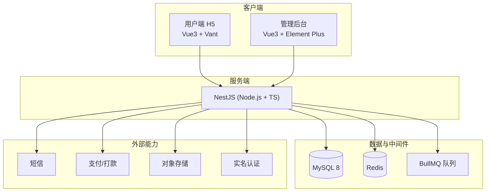

# 技术栈选型

> 版本：v1.0　|　配套文档：《产品页面清单与功能拆解.md》《后台管理端页面清单与功能拆解.md》《页面路由表与开发排期.md》《数据模型与接口字段清单.md》
>
> 选型原则：全程 TypeScript 一致，用户端 H5 与管理后台同栈、前后端同语言，最大化复用人力与经验，迭代快；同时满足贡献金 / 提现 / 藏品交易的资金一致性要求。

---

## 一、技术栈总览



---

## 二、用户端 H5（移动端）

| 类别 | 选型 | 说明 |
| --- | --- | --- |
| 框架 | Vue3 + Vite + TypeScript | 组合式 API，构建快 |
| 组件库 | Vant | 国内电商 H5 主流，商品卡/SKU/地址/下拉刷新等组件最齐全 |
| 状态管理 | Pinia | Vue3 官方推荐 |
| 路由 | Vue Router | 按《页面路由表》落地 |
| 请求 | Axios | 统一拦截器、Token 注入、错误处理 |
| 调试 | vConsole | 移动端真机调试 |

---

## 三、管理后台（PC Web）

| 类别 | 选型 | 说明 |
| --- | --- | --- |
| 框架 | Vue3 + Vite + TypeScript | 与 H5 同栈，复用人力 |
| 组件库 | Element Plus | 中后台表格/表单/权限模板成熟 |
| 状态管理 | Pinia | |
| 路由 | Vue Router | 动态路由 + 权限菜单 |
| 图表 | ECharts | 数据看板 |

---

## 四、后端服务

| 类别 | 选型 | 说明 |
| --- | --- | --- |
| 运行时/框架 | Node.js + NestJS（TypeScript） | 模块化、结构规范，与前端同语言 |
| ORM | TypeORM 或 Prisma | 配合 MySQL 事务，保证资产一致性 |
| 参数校验 | class-validator / class-transformer | DTO 校验 |
| 鉴权 | JWT + Guard | 用户端 Token、后台 RBAC 权限 |
| 接口文档 | Swagger（@nestjs/swagger） | 自动生成 OpenAPI |
| 定时任务 | @nestjs/schedule | 订单超时关闭、打卡漏卡结算 |

---

## 五、数据库与中间件

| 类别 | 选型 | 说明 |
| --- | --- | --- |
| 主数据库 | MySQL 8 | 成熟可靠，事务保证贡献金/提现金流水强一致 |
| 缓存 | Redis | 短信验证码、打卡签到状态、库存防超卖、分布式锁 |
| 消息队列 | BullMQ（基于 Redis） | 订单超时关闭、异步发放贡献金、提现打款；量大可平滑升级 RocketMQ |

---

## 六、存储与外部能力（必接）

| 能力 | 选型 | 用途 |
| --- | --- | --- |
| 对象存储 | 阿里云 OSS / 腾讯云 COS | 商品图、藏品资源、售后凭证 |
| 短信 | 阿里云 / 腾讯云短信 | 注册/登录/找回密码验证码 |
| 支付 | 微信支付 + 支付宝 | 商品下单支付 |
| 打款 | 微信企业付款 / 支付宝转账 | 提现金到账 |
| 实名认证 | 三要素 / 人脸认证 | 藏品交易、提现前置 |

---

## 七、工程化与部署

| 类别 | 选型 | 说明 |
| --- | --- | --- |
| 仓库结构 | Monorepo（pnpm workspace） | 统一管理 `h5` / `admin` / `server` |
| 代码规范 | ESLint + Prettier + Husky + lint-staged | 提交前校验 |
| 容器化 | Docker + docker-compose | 一致的开发/部署环境 |
| 网关/托管 | Nginx | H5/Admin 静态托管 + API 反向代理 |
| CI/CD | GitHub Actions / GitLab CI | 自动构建部署 |

### 建议目录结构（Monorepo）

```text
shareMall/
├── apps/
│   ├── h5/        # 用户端 H5 (Vue3 + Vant)
│   ├── admin/     # 管理后台 (Vue3 + Element Plus)
│   └── server/    # 后端 (NestJS)
├── packages/
│   └── shared/    # 共享类型/常量/工具 (TS)
├── docs/          # 产品与技术文档
└── docker-compose.yml
```

---

## 八、选型理由小结

- 全栈 TypeScript：前端 H5、后台、后端同语言，类型可在 `packages/shared` 共享，减少联调成本。
- Vue3 + Vant + Element Plus：H5 与后台同栈，组件成熟，电商场景开箱即用，团队学习成本低。
- NestJS + MySQL + Redis：模块化后端 + 事务型数据库 + 缓存/锁，能稳妥支撑贡献金累计、打卡兑现、提现、藏品交易等对一致性敏感的资金类业务。
- Monorepo + Docker：统一工程与环境，便于按《开发排期》M1→M4 分阶段交付。

---

## 九、说明

- 外部资质（支付、短信、打款、实名）需在项目启动期并行申请，避免阻塞 M1/M2 联调。
- ORM 在 TypeORM 与 Prisma 之间二选一：偏好显式实体与复杂事务选 TypeORM，偏好类型安全与开发体验选 Prisma；可在搭建骨架时最终敲定。
