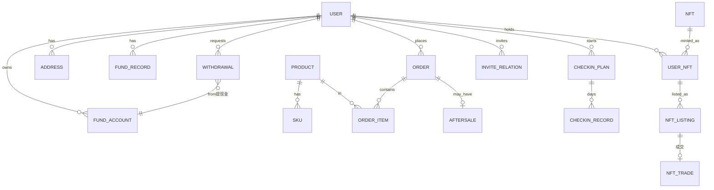

# 核心数据模型与接口字段清单

> 版本：v1.0　|　配套文档：《产品页面清单与功能拆解.md》《后台管理端页面清单与功能拆解.md》《页面路由表与开发排期.md》
>
> 说明：字段类型为逻辑类型（string/int/decimal/datetime/enum/json），落库时按所选数据库映射。金额统一建议用 decimal(12,2)，贡献金/提现金同样按金额精度处理。所有表默认含 `created_at` / `updated_at`，软删除表含 `deleted_at`。

---

## 一、实体关系总览

---

## 二、核心数据模型

### 2.1 用户与账户

#### user（用户）
| 字段 | 类型 | 说明 |
| --- | --- | --- |
| id | bigint PK | 用户 ID |
| phone | string | 手机号（唯一，登录账号） |
| password_hash | string | 密码哈希 |
| nickname | string | 昵称 |
| avatar | string | 头像 URL |
| gender | enum | unknown/male/female |
| birthday | date | 生日 |
| status | enum | normal/frozen/blacklist |
| kyc_status | enum | none/pending/passed/rejected |
| invite_code | string | 本人的邀请码（唯一） |
| inviter_id | bigint | 邀请人用户 ID（可空） |
| register_ip | string | 注册 IP |
| last_login_at | datetime | 最近登录时间 |

#### user_kyc（实名认证）
| 字段 | 类型 | 说明 |
| --- | --- | --- |
| id | bigint PK | |
| user_id | bigint FK | |
| real_name | string | 真实姓名 |
| id_card_no | string | 身份证号（加密存储） |
| status | enum | pending/passed/rejected |
| reject_reason | string | 驳回原因 |
| audited_by | bigint | 审核管理员 |
| audited_at | datetime | 审核时间 |

#### invite_relation（邀请关系）
| 字段 | 类型 | 说明 |
| --- | --- | --- |
| id | bigint PK | |
| inviter_id | bigint | 邀请人 |
| invitee_id | bigint | 被邀请人 |
| invite_code | string | 使用的邀请码 |
| reward_status | enum | pending/granted/none |

#### address（收货地址）
| 字段 | 类型 | 说明 |
| --- | --- | --- |
| id | bigint PK | |
| user_id | bigint FK | |
| receiver | string | 收货人 |
| phone | string | 联系电话 |
| province / city / district | string | 省市区 |
| detail | string | 详细地址 |
| is_default | bool | 是否默认 |

#### fund_account（资产账户，三类资产）
| 字段 | 类型 | 说明 |
| --- | --- | --- |
| id | bigint PK | |
| user_id | bigint FK unique | |
| pending_fund | decimal | 待兑现贡献金 |
| available_fund | decimal | 可用贡献金（站内，1=1元） |
| withdrawable_cash | decimal | 提现金（可提现余额） |
| frozen_cash | decimal | 提现冻结中金额 |

> 设计要点：三类资产同表分列；**待兑现/可用贡献金**变动必须写 `fund_record` 流水；**提现金**部分场景（藏品成交入账、提现冻结）仅改余额。详见 [贡献金业务说明.md](./贡献金业务说明.md)。

### 2.2 商品与购物

#### product（商品）
| 字段 | 类型 | 说明 |
| --- | --- | --- |
| id | bigint PK | |
| title | string | 商品名称 |
| category_id | bigint FK | 分类 |
| main_image | string | 主图 |
| images | json | 轮播图数组 |
| detail_html | text | 图文详情 |
| price | decimal | 默认售价（无 SKU 时） |
| market_price | decimal | 划线价 |
| fund_ratio | decimal | 贡献金比例（覆盖全局默认，可空） |
| allow_fund_deduct | bool | 是否支持贡献金抵扣 |
| deduct_limit_rate | decimal | 抵扣占订单上限% |
| sales | int | 销量 |
| status | enum | on_sale/off_shelf |
| sort | int | 排序 |

#### sku（商品规格）
| 字段 | 类型 | 说明 |
| --- | --- | --- |
| id | bigint PK | |
| product_id | bigint FK | |
| spec | json | 规格组合（如 颜色/尺码） |
| price | decimal | 价格 |
| stock | int | 库存 |
| sku_image | string | 规格图 |

#### category（分类）
| 字段 | 类型 | 说明 |
| --- | --- | --- |
| id | bigint PK | |
| parent_id | bigint | 父级（0=一级） |
| name | string | 名称 |
| icon | string | 图标 |
| sort | int | 排序 |
| fund_ratio | decimal | 分类级贡献金比例（可空） |

#### cart_item（购物车）
| 字段 | 类型 | 说明 |
| --- | --- | --- |
| id | bigint PK | |
| user_id | bigint FK | |
| product_id / sku_id | bigint | 商品/规格 |
| quantity | int | 数量 |
| checked | bool | 是否选中 |

#### banner（轮播/活动位）
| 字段 | 类型 | 说明 |
| --- | --- | --- |
| id | bigint PK | |
| position | enum | home_top/home_grid/activity |
| image | string | 图片 |
| link | string | 跳转 |
| sort | int | 排序 |
| start_at / end_at | datetime | 生效时间 |

### 2.3 订单与售后

#### order（订单）
| 字段 | 类型 | 说明 |
| --- | --- | --- |
| id | bigint PK | |
| order_no | string | 订单号（唯一） |
| user_id | bigint FK | |
| address_snapshot | json | 收货地址快照 |
| total_amount | decimal | 商品总额 |
| fund_deduct_amount | decimal | 贡献金抵扣额（消耗可用贡献金） |
| coupon_amount | decimal | 优惠券抵扣 |
| freight | decimal | 运费 |
| pay_amount | decimal | 实付金额 |
| accrued_fund | decimal | 本单可累计的待兑现贡献金 |
| status | enum | unpaid/paid/shipped/received/completed/closed |
| pay_method | enum | wechat/alipay/balance |
| paid_at / shipped_at / received_at | datetime | 关键时间 |

#### order_item（订单明细）
| 字段 | 类型 | 说明 |
| --- | --- | --- |
| id | bigint PK | |
| order_id | bigint FK | |
| product_id / sku_id | bigint | |
| product_snapshot | json | 商品快照（名称/图/规格） |
| price | decimal | 成交单价 |
| quantity | int | 数量 |
| item_fund | decimal | 该行累计贡献金 |

#### aftersale（售后）
| 字段 | 类型 | 说明 |
| --- | --- | --- |
| id | bigint PK | |
| order_id | bigint FK | |
| type | enum | refund_only/return_refund |
| reason | string | 原因 |
| evidence | json | 凭证图片 |
| refund_amount | decimal | 退款金额 |
| fund_rollback | decimal | 回退的已抵扣可用贡献金 |
| fund_void | decimal | 冲销的待兑现贡献金 |
| status | enum | pending/approved/rejected/refunded |

#### payment（支付记录）
| 字段 | 类型 | 说明 |
| --- | --- | --- |
| id | bigint PK | |
| order_id | bigint FK | |
| channel | enum | wechat/alipay |
| trade_no | string | 第三方交易号 |
| amount | decimal | 支付金额 |
| status | enum | pending/success/failed |

### 2.4 贡献金体系

#### fund_record（贡献金/提现金流水）
| 字段 | 类型 | 说明 |
| --- | --- | --- |
| id | bigint PK | |
| user_id | bigint FK | |
| asset_type | enum | pending_fund/available_fund/withdrawable_cash |
| change_type | enum | order_accrue/checkin_start/checkin_cashout/order_deduct/nft_exchange/nft_trade_buy/nft_trade_income/aftersale_void/aftersale_rollback/withdraw/task_reward |
| amount | decimal | 变动额（正负） |
| balance_after | decimal | 变动后该资产余额 |
| ref_type | enum | order/checkin/nft/withdraw/task |
| ref_id | bigint | 关联单据 ID |
| remark | string | 备注 |

#### checkin_plan（打卡兑现计划）
| 字段 | 类型 | 说明 |
| --- | --- | --- |
| id | bigint PK | |
| user_id | bigint FK | |
| tier | enum | 90/180/360/720（档位金额） |
| total_amount | decimal | 该档位总兑现额 |
| daily_amount | decimal | 每日兑现额（total/天数） |
| total_days | int | 打卡天数（默认 30） |
| signed_days | int | 已签到天数 |
| cashed_amount | decimal | 已兑现额 |
| void_amount | decimal | 漏卡作废额 |
| status | enum | active/completed/terminated |
| started_at | datetime | 发起时间 |

#### checkin_record（每日打卡记录）
| 字段 | 类型 | 说明 |
| --- | --- | --- |
| id | bigint PK | |
| plan_id | bigint FK | |
| user_id | bigint FK | |
| day_index | int | 第几天（1..30） |
| checkin_date | date | 打卡日期 |
| status | enum | signed/missed |
| cashout_amount | decimal | 当天兑现额（漏卡为 0） |

#### task / task_record（任务与完成记录）
| 字段 | 类型 | 说明 |
| --- | --- | --- |
| task.id | bigint PK | |
| task.type | enum | sign/invite/first_order/share/browse |
| task.reward_type | enum | fund/other |
| task.reward_value | decimal | 奖励数值 |
| task.rule | json | 完成条件 |
| task_record.user_id | bigint | 用户 |
| task_record.task_id | bigint | 任务 |
| task_record.status | enum | ongoing/completed/claimed |

### 2.5 数字藏品

> 定价规则见 [数字藏品业务说明.md](./数字藏品业务说明.md)。

#### nft（藏品/电子 IP 定义）
| 字段 | 类型 | 说明 |
| --- | --- | --- |
| id | bigint PK | |
| name | string | 名称 |
| cover | string | 封面/资源 URL |
| publisher | string | 发行方 |
| total_supply | int | 发行量 |
| stock | int | 兑换剩余库存 |
| exchange_fund | decimal | 兼容字段，同步 current_price |
| start_price | decimal | **起始价格**（后台设置） |
| current_price | decimal | **当前参考价**（每日波动） |
| last_price_date | date | 上次日波动更新日期 |
| limit_per_user | int | 每人限兑 |
| rights_desc | text | 权益说明 |
| status | enum | on_sale/off_shelf |

#### nft_price_history（每日价格历史）
| 字段 | 类型 | 说明 |
| --- | --- | --- |
| id | bigint PK | |
| nft_id | bigint FK | |
| price_date | date | 日期 |
| price | decimal | 当日收盘价/参考价 |
| change_pct | decimal | 相对前一日涨跌幅 |

#### user_nft（用户持有藏品）
| 字段 | 类型 | 说明 |
| --- | --- | --- |
| id | bigint PK | |
| user_id | bigint FK | |
| nft_id | bigint FK | |
| serial_no | string | 唯一编号/链上标识 |
| source | enum | exchange/trade_buy/transfer |
| status | enum | holding/listed/sold/transferred |
| acquired_at | datetime | 获得时间 |

#### nft_listing（挂单）
| 字段 | 类型 | 说明 |
| --- | --- | --- |
| id | bigint PK | |
| user_nft_id | bigint FK | |
| seller_id | bigint | 卖家 |
| price | decimal | 挂单时参考价快照（= current_price） |
| fee_rate | decimal | 平台手续费比例（下单时快照） |
| status | enum | listing/sold/cancelled/removed |

#### nft_trade（成交记录）
| 字段 | 类型 | 说明 |
| --- | --- | --- |
| id | bigint PK | |
| listing_id | bigint FK | |
| buyer_id | bigint | 买家 |
| seller_id | bigint | 卖家 |
| price | decimal | **实际成交价**（动态计算） |
| reference_price | decimal | 成交时参考价 |
| deal_premium_factor | decimal | 成交随机因子 0~1 |
| fee | decimal | 平台手续费 |
| seller_income | decimal | 卖家所得（入提现金 = price - fee） |
| traded_at | datetime | 成交时间 |

### 2.6 提现

#### withdrawal（提现申请）
| 字段 | 类型 | 说明 |
| --- | --- | --- |
| id | bigint PK | |
| user_id | bigint FK | |
| amount | decimal | 提现金额（来源提现金） |
| fee | decimal | 提现手续费 |
| actual_amount | decimal | 实际到账 |
| method | enum | bank/wechat/alipay |
| account_info | json | 收款账户（加密/脱敏） |
| status | enum | pending/auditing/approved/paying/paid/rejected/failed |
| reject_reason | string | 驳回/失败原因 |
| audited_by | bigint | 审核人 |
| paid_at | datetime | 到账时间 |

### 2.7 系统与配置

#### config（全局配置，键值/分组）
| 字段 | 类型 | 说明 |
| --- | --- | --- |
| id | bigint PK | |
| group | string | 分组（fund/withdraw/nft/sms/invite） |
| key | string | 配置键 |
| value | json | 配置值 |
| effective_at | datetime | 生效时间 |

> 关键配置键示例：`fund.default_ratio`、`fund.tiers`、`fund.checkin_days`、`fund.miss_rule`、`fund.deduct_limit_rate`、`fund.market_fee_rate`、`nft.market`（含 `dailyFluctuationPct`、`dealPremiumPct`）、`withdraw.min/max/fee`、`invite.required`、`sms.provider`。

#### admin_user / role / operation_log（后台账号/角色/操作日志）
- admin_user：id、username、password_hash、role_id、status。
- role：id、name、permissions(json)、data_scope。
- operation_log：id、admin_id、module、action、detail(json)、ip、created_at。

---

## 三、核心接口清单

> 约定：REST 风格，鉴权用 `Authorization: Bearer <token>`。统一响应：`{ code, message, data }`。分页参数 `page` / `pageSize`，返回 `{ list, total }`。

### 3.1 认证

| 接口 | 方法 | 路径 | 请求字段 | 响应字段 |
| --- | --- | --- | --- | --- |
| 发送短信验证码 | POST | `/api/auth/sms` | phone, scene(register/login/reset), captcha | success |
| 注册 | POST | `/api/auth/register` | phone, smsCode, password, inviteCode | token, userId |
| 账密登录 | POST | `/api/auth/login` | phone, password | token, userInfo |
| 短信登录 | POST | `/api/auth/login-sms` | phone, smsCode | token, userInfo |
| 重置密码 | POST | `/api/auth/reset-password` | phone, smsCode, newPassword | success |
| 实名认证提交 | POST | `/api/user/kyc` | realName, idCardNo | status |

### 3.2 商品与购物

| 接口 | 方法 | 路径 | 请求/响应要点 |
| --- | --- | --- | --- |
| 首页聚合 | GET | `/api/home` | 返回 banners, categories, products |
| 商品列表 | GET | `/api/products` | 入参 categoryId, keyword, sort, page；返回含 price, fundAmount |
| 商品详情 | GET | `/api/products/:id` | 返回 images, skus, price, fundRatio, allowFundDeduct |
| 实时下单动态 | GET | `/api/products/:id/order-feed` | 返回滚动动态列表（脱敏） |
| 购物车列表 | GET | `/api/cart` | 返回 items, totalAmount, totalFund |
| 加入购物车 | POST | `/api/cart` | productId, skuId, quantity |
| 更新/删除购物车 | PUT/DELETE | `/api/cart/:id` | quantity / — |

### 3.3 订单与支付

| 接口 | 方法 | 路径 | 请求/响应要点 |
| --- | --- | --- | --- |
| 下单预览（试算） | POST | `/api/orders/preview` | items, addressId, useFund(bool), fundAmount → 返回金额明细、可抵扣上限、预计累计贡献金 |
| 创建订单 | POST | `/api/orders` | items, addressId, useFund, fundAmount, couponId → 返回 orderNo |
| 发起支付 | POST | `/api/orders/:id/pay` | channel → 返回支付参数 |
| 支付结果查询 | GET | `/api/orders/:id/pay-status` | 返回 status |
| 订单列表 | GET | `/api/orders` | status, page |
| 订单详情 | GET | `/api/orders/:id` | 含 fundDeductAmount, accruedFund |
| 确认收货 | POST | `/api/orders/:id/receive` | — |
| 申请售后 | POST | `/api/aftersale` | orderId, type, reason, evidence |

### 3.4 贡献金与打卡

| 接口 | 方法 | 路径 | 请求/响应要点 |
| --- | --- | --- | --- |
| 资产总览 | GET | `/api/fund/account` | pendingFund, availableFund, withdrawableCash, 各档位达标状态 |
| 贡献金流水 | GET | `/api/fund/records` | 默认仅 pending/available；可选 assetType=withdrawable_cash |
| 发起打卡 | POST | `/api/fund/checkin/start` | tier → 返回 planId（校验是否达档位） |
| 每日打卡 | POST | `/api/fund/checkin/sign` | planId → 返回 cashoutAmount, signedDays |
| 打卡计划详情 | GET | `/api/fund/checkin/:planId` | totalAmount, dailyAmount, signedDays, voidAmount, status |
| 打卡记录 | GET | `/api/fund/checkin/:planId/records` | 每日 signed/missed |
| 任务列表 | GET | `/api/tasks` | 返回任务及完成状态 |
| 领取任务奖励 | POST | `/api/tasks/:id/claim` | — |

### 3.5 数字藏品与二级市场

| 接口 | 方法 | 路径 | 请求/响应要点 |
| --- | --- | --- | --- |
| 藏品商城列表 | GET | `/api/nft` | startPrice, currentPrice, dealPriceMin/Max, stock |
| 藏品详情 | GET | `/api/nft/:id` | rightsDesc, priceHistory（近30日） |
| 价格走势 | GET | `/api/nft/:id/price-history` | days 默认 30 |
| 兑换藏品 | POST | `/api/nft/:id/exchange` | 服务端计算 dealPrice 并扣 available_fund |
| 我的藏品 | GET | `/api/nft/mine` | 含 status, currentPrice |
| 挂单卖出 | POST | `/api/nft/listings` | userNftId（无 price）→ 参考价快照 |
| 撤单/同步价 | DELETE/PUT | `/api/nft/listings/:id` | PUT 同步当前参考价 |
| 二级市场列表 | GET | `/api/nft/trade` | 含 referencePrice, dealPriceMin/Max |
| 购买挂单 | POST | `/api/nft/trade/:listingId/buy` | dealPrice 动态计算；买家扣 available_fund |
| 交易记录 | GET | `/api/nft/trade/records` | type, page；含 referencePrice |

### 3.6 个人中心与提现

| 接口 | 方法 | 路径 | 请求/响应要点 |
| --- | --- | --- | --- |
| 个人信息 | GET/PUT | `/api/user/profile` | nickname, avatar, gender, birthday |
| 地址列表/增改删 | GET/POST/PUT/DELETE | `/api/user/address` | 地址字段 |
| 我的邀请 | GET | `/api/user/invite` | inviteCode, invitedCount, list |
| 提现规则 | GET | `/api/withdraw/config` | min, max, fee, methods |
| 申请提现 | POST | `/api/withdraw` | amount, method, accountInfo → 校验提现金余额与实名 |
| 提现记录 | GET | `/api/withdraw/records` | status, page |
| 消息列表 | GET | `/api/messages` | type, page |

### 3.7 后台（示例，需鉴权 + 权限）

| 接口 | 方法 | 路径 | 要点 |
| --- | --- | --- | --- |
| 贡献金比例配置 | GET/PUT | `/api/admin/fund/ratio` | global/category/product 级 + 生效时间 |
| 档位/打卡/抵扣规则 | GET/PUT | `/api/admin/fund/rules` | tiers, checkinDays, missRule, deductLimit |
| 提现审核 | POST | `/api/admin/withdraw/:id/audit` | action(pass/reject), reason |
| 藏品发行 | POST | `/api/admin/nft` | name, supply, startPrice, limit |
| 二级市场配置 | GET/PUT | `/api/admin/nft/market` | enabled, dailyFluctuationPct, dealPremiumPct, min/maxPrice, requireKyc |
| 实名审核 | POST | `/api/admin/kyc/:id/audit` | action, reason |

---

## 四、关键一致性与事务约定

> 完整说明见 [贡献金业务说明.md](./贡献金业务说明.md)。

- **待兑现/可用贡献金**：余额变更与 `fund_record` 必须在同一数据库事务内完成。
- **下单抵扣**：创建订单时校验并扣减 `available_fund`，写 `order_deduct` 流水。
- **贡献金累计**：**确认收货后**（或自动收货）才 `pending_fund` 入账，写 `order_accrue`；支付成功不入账。
- **打卡**：开启打卡扣 `pending_fund`（`checkin_start`）；签到增加 `available_fund`（`checkin_cashout`）。
- **藏品兑换/购买**：扣 `available_fund`，成交价 = `currentPrice × (1 + random × dealPremiumPct)`，写 `nft_exchange` / `nft_trade_buy`。
- **藏品成交（卖家）**：转移 `user_nft` 归属（同 serial_no）→ 卖家 `withdrawable_cash` 增加（price - fee）→ **不写 fund_record** → 记 `nft_trade`。
- **提现**：申请冻结 `withdrawable_cash`→`frozen_cash`；打款成功写 `withdraw` 流水并扣冻结；驳回解冻。
- **售后**：回退抵扣 + 冲销累计，均写流水。

---

## 五、说明

- 本清单为核心字段级蓝图，未穷尽全部辅助字段；实际以详细技术设计（DDL + OpenAPI）为准。
- 贡献金三类资产、流水范围与二级市场资金规则：见 [贡献金业务说明.md](./贡献金业务说明.md)。
- 数字藏品定价、波动、成交规则：见 [数字藏品业务说明.md](./数字藏品业务说明.md)。
- 涉及身份证、收款账户等敏感信息需加密存储并脱敏展示，遵循合规要求。
