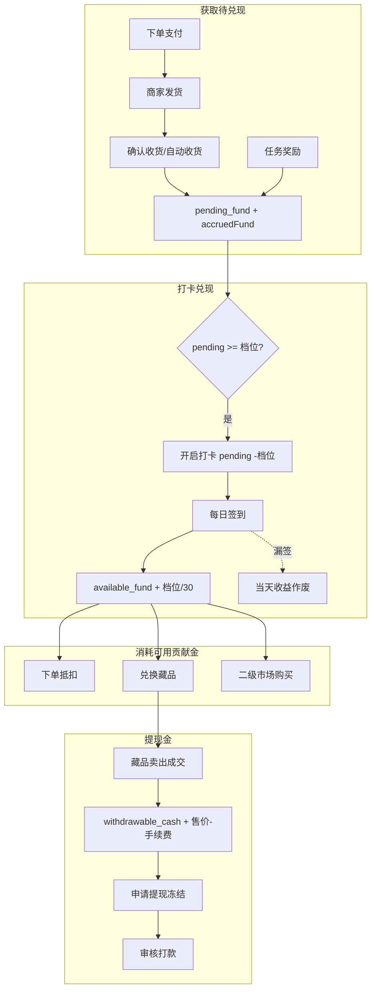

# 贡献金业务说明

> 版本：v1.0（2026-06-13）  
> 与当前代码实现对齐：`apps/server/src/modules/fund`、`order`、`nft`、`withdraw`、`aftersale`、`task`

---

## 一、三类资产

| 资产 | 字段 | 来源 | 用途 | 可提现 |
| --- | --- | --- | --- | --- |
| 待兑现贡献金 | `pending_fund` | 确认收货后累计；任务奖励（默认） | 达档位后开启打卡 | 否 |
| 可用贡献金 | `available_fund` | 打卡兑现 | 下单抵扣、兑换藏品、二级市场购买 | 否 |
| 提现金 | `withdrawable_cash` | 藏品二级市场成交（卖家所得） | 申请提现 | 是 |

**换算**：1 贡献金 = 1 元（站内）。  
**存储**：`fund_account` 表三列 + `frozen_cash`（提现冻结）。

---

## 二、全链路流转

---

## 三、各环节规则

### 3.1 购物 → 待兑现贡献金

| 时机 | 行为 |
| --- | --- |
| 下单试算 | 按商品/分类/全局 `fund_ratio` 计算 `accruedFund`，**仅展示** |
| 创建订单 | 若使用抵扣，**立即扣** `available_fund` |
| 支付成功 | **不入账**，订单记录预计贡献金 |
| 确认收货 | `pending_fund` **+ accruedFund**；发货满 7 天自动收货同理 |

**抵扣上限**：单行 `deduct_limit_rate`（默认 50% 商品金额），且不超过当前可用贡献金。

### 3.2 打卡兑现 → 可用贡献金

- **档位**：90 / 180 / 360 / 720（`config.fund.rules.tiers`）
- **开启打卡**：`pending_fund` 扣减档位全额，创建 30 天计划
- **每日签到**：`available_fund` 增加 `档位 / 30`
- **漏签**（默认 `missRule=void`）：当天收益作废

### 3.3 可用贡献金消耗

| 场景 | 资产 | 流水 `change_type` | 贡献金明细 |
| --- | --- | --- | --- |
| 下单抵扣 | `available_fund` − | `order_deduct` | ✅ |
| 兑换藏品 | `available_fund` − | `nft_exchange` | ✅ | 扣款为动态 dealPrice |
| 二级市场购买 | `available_fund` − | `nft_trade_buy` | ✅ | 扣款为动态 dealPrice |

### 3.4 提现金

| 场景 | 资产 | 流水 | 贡献金明细 |
| --- | --- | --- | --- |
| 藏品成交（卖家） | `withdrawable_cash` + (售价−手续费) | **不写** `fund_record` | ❌ |
| 提现申请 | `withdrawable_cash` −，`frozen_cash` + | 申请阶段无流水 | ❌ |
| 审核打款成功 | `frozen_cash` − | `withdraw` | ❌（明细页已过滤） |
| 审核驳回 | 解冻退回 `withdrawable_cash` | 无 | ❌ |

成交详情查 **`nft_trade`** 表；卖家余额在贡献金中心展示。

**二级市场手续费**：`config.fund.rules.marketFeeRate`（默认 5%），挂单时快照至 `nft_listing.fee_rate`。

**藏品定价**（兑换/购买扣款基数）：见 [数字藏品业务说明.md](./数字藏品业务说明.md)。成交价为 `currentPrice × (1 + random × dealPremiumPct)`，非固定兑换价。

### 3.5 任务奖励

领取任务 → 默认入 **`pending_fund`**（`task_reward`），需打卡兑现后才变为可用贡献金。

### 3.6 售后

同意退款时：

- 回退已抵扣 → `available_fund` +（`aftersale_rollback`）
- 冲销已累计 → `pending_fund` −（`aftersale_void`，仅确认收货后累计过的订单）

---

## 四、贡献金明细页（`/fund/records`）

**范围**：默认仅展示 `pending_fund` 与 `available_fund` 的流水，不含提现金变动。

**包含类型**：`order_accrue`、`checkin_start`、`checkin_cashout`、`order_deduct`、`nft_exchange`、`nft_trade_buy`、`aftersale_*`、`task_reward` 等。

**不包含**：藏品成交入提现金、提现打款等。传 `assetType=withdrawable_cash` 可单独查询提现金流水（后台/对账用）。

---

## 五、流水写入约定

| 变更类型 | 是否写 `fund_record` | 说明 |
| --- | --- | --- |
| 待兑现 / 可用贡献金变动 | ✅ 必须 | 同事务更新 `fund_account` |
| 卖家藏品成交入提现金 | ❌ | 仅更新余额，记录 `nft_trade` |
| 提现申请冻结/驳回解冻 | ❌ | 直接改 `fund_account` |
| 提现打款成功 | ✅ | `withdraw`，`asset_type=withdrawable_cash` |

`fund_account.version` 乐观锁，冲突最多重试 3 次。

---

## 六、后台配置

统一存储于 `config` 表：

| 分组 | 键 | 内容 |
| --- | --- | --- |
| `fund` | `rules` | `defaultRatio`、`tiers`、`checkinDays`、`missRule`、`deductLimitRate`、`marketFeeRate` |
| `nft` | `market` | `enabled`、`minPrice`、`maxPrice`、`requireKyc`、`dailyFluctuationPct`、`dealPremiumPct` |
| `withdraw` | `rules` | 提现门槛、手续费、方式、是否需实名 |

后台页面：`/admin/fund`（规则+测试充值）、`/admin/nft`（含二级市场开关）。

---

## 七、数据库迁移

本地库需依次执行：

1. `002_add_checkin_start_fund_record.sql` — 含 `checkin_start`
2. `003_admin_rbac.sql` — 后台 RBAC
3. `004_add_nft_trade_buy_fund_record.sql` — 含 `nft_trade_buy`
4. `005_nft_dynamic_price.sql` — 动态价格字段与 `nft_price_history`

---

## 八、相关文档

- [产品页面清单与功能拆解.md](./产品页面清单与功能拆解.md)
- [数据模型与接口字段清单.md](./数据模型与接口字段清单.md)
- [数据库DDL.md](./数据库DDL.md)
