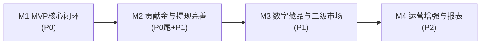

# 页面路由表与开发优先级排期

> 版本：v1.0　|　配套文档：《产品页面清单与功能拆解.md》《后台管理端页面清单与功能拆解.md》

---

## 一、优先级说明

- P0（MVP 必做）：跑通「注册登录 → 浏览下单 → 支付 → 贡献金累计/打卡兑现 → 抵扣」的核心闭环。
- P1（重要）：数字藏品兑换/二级市场/提现，以及完善订单售后、营销基础。
- P2（增强）：体验优化、运营增强、报表与高级风控。

> 路由为建议命名，开发时可按实际框架（Vue Router / React Router）调整。

---

## 二、用户端 H5 路由表

### 模块一　账号与认证

| 页面 | 路由 | 优先级 | 备注 |
| --- | --- | --- | --- |
| 启动/引导页 | `/splash` | P1 | 首次引导，可后置 |
| 登录页 | `/login` | P0 | 账密 + 短信 |
| 注册页 | `/register` | P0 | 邀请码 + 短信 |
| 忘记/重置密码页 | `/reset-password` | P1 | |
| 实名认证页 | `/kyc` | P1 | 提现/藏品前置 |
| 协议页 | `/agreement/:type` | P0 | 注册需勾选 |

### 模块二　商品与购物

| 页面 | 路由 | 优先级 | 备注 |
| --- | --- | --- | --- |
| 商品首页 | `/home` | P0 | 底部 Tab |
| 搜索页 | `/search` | P1 | |
| 分类列表页 | `/category` | P1 | |
| 商品详情页 | `/product/:id` | P0 | 含实时下单动态、贡献金展示 |
| 购物车页 | `/cart` | P0 | |
| 确认订单页 | `/order/confirm` | P0 | 含贡献金抵扣 |
| 收银台/支付页 | `/order/pay/:orderId` | P0 | |
| 支付结果页 | `/order/result/:orderId` | P0 | |

### 模块三　订单与售后

| 页面 | 路由 | 优先级 | 备注 |
| --- | --- | --- | --- |
| 订单列表页 | `/orders` | P0 | 状态 Tab |
| 订单详情页 | `/orders/:id` | P0 | |
| 物流跟踪页 | `/orders/:id/logistics` | P1 | |
| 售后/退款页 | `/aftersale` `/aftersale/:id` | P1 | 含贡献金冲销 |
| 评价页 | `/orders/:id/review` | P2 | |

### 模块四　贡献金体系（核心）

| 页面 | 路由 | 优先级 | 备注 |
| --- | --- | --- | --- |
| 贡献金中心/钱包页 | `/fund` | P0 | 待兑现+可用+档位 |
| 打卡兑现页 | `/fund/checkin` | P0 | 30 天签到 |
| 打卡日历/兑现记录页 | `/fund/checkin/records` | P1 | |
| 贡献金明细页 | `/fund/records` | P0 | 收支流水 |
| 任务中心 | `/tasks` | P1 | |

### 模块五　数字藏品 / 电子 IP

| 页面 | 路由 | 优先级 | 备注 |
| --- | --- | --- | --- |
| 藏品兑换商城页 | `/nft/market` | P1 | 贡献金兑换 |
| 藏品详情页 | `/nft/:id` | P1 | |
| 我的数字藏品页 | `/nft/mine` | P1 | |
| 持有藏品详情页 | `/nft/mine/:id` | P1 | |
| 挂单卖出页 | `/nft/mine/:id/sell` | P1 | 成交所得入提现金 |
| 二级交易市场页 | `/nft/trade` | P1 | |
| 我的挂单管理页 | `/nft/listings` | P1 | |
| 交易记录页 | `/nft/trade/records` | P2 | |

### 模块六　个人中心

| 页面 | 路由 | 优先级 | 备注 |
| --- | --- | --- | --- |
| 个人中心首页 | `/mine` | P0 | 展示可用贡献金+提现金 |
| 提现页 | `/withdraw` | P1 | 仅提现金可提 |
| 提现记录页 | `/withdraw/records` | P1 | |
| 基本信息编辑页 | `/mine/profile` | P0 | |
| 收货地址管理页 | `/mine/address` | P0 | |
| 我的邀请页 | `/mine/invite` | P1 | 邀请码分享 |
| 消息通知页 | `/messages` | P2 | |
| 设置页 | `/settings` | P1 | |
| 帮助/客服页 | `/support` | P2 | |

### 模块七　通用/系统

| 页面 | 路由 | 优先级 | 备注 |
| --- | --- | --- | --- |
| 在线客服页 | `/service` | P2 | |
| 错误/异常页 | `/error` `/404` | P1 | |
| 空状态/全局组件 | — | P0 | 贯穿各列表页 |

---

## 三、后台管理端路由表

| 模块 | 页面 | 路由 | 优先级 |
| --- | --- | --- | --- |
| 权限 | 后台登录 | `/admin/login` | P0 |
| 权限 | 角色管理 | `/admin/roles` | P1 |
| 权限 | 管理员账号 | `/admin/accounts` | P1 |
| 权限 | 操作日志 | `/admin/logs` | P1 |
| 看板 | 经营概览 | `/admin/dashboard` | P1 |
| 商品 | 商品列表 | `/admin/products` | P0 |
| 商品 | 商品编辑（含贡献金比例） | `/admin/products/edit/:id` | P0 |
| 商品 | 分类管理 | `/admin/categories` | P0 |
| 商品 | 轮播/活动位 | `/admin/banners` | P1 |
| 商品 | 实时下单动态配置 | `/admin/order-feed` | P2 |
| 商品 | 评价管理 | `/admin/reviews` | P2 |
| 订单 | 订单列表 | `/admin/orders` | P0 |
| 订单 | 订单详情 | `/admin/orders/:id` | P0 |
| 订单 | 发货/物流 | `/admin/shipping` | P0 |
| 订单 | 售后管理 | `/admin/aftersale` | P1 |
| 用户 | 用户列表 | `/admin/users` | P0 |
| 用户 | 用户详情 | `/admin/users/:id` | P0 |
| 用户 | 实名审核 | `/admin/kyc` | P1 |
| 用户 | 邀请关系/邀请码 | `/admin/invite` | P1 |
| 贡献金 | 比例配置 | `/admin/fund/ratio` | P0 |
| 贡献金 | 档位配置 | `/admin/fund/tiers` | P0 |
| 贡献金 | 打卡规则 | `/admin/fund/checkin-rule` | P0 |
| 贡献金 | 抵扣规则 | `/admin/fund/deduct-rule` | P0 |
| 贡献金 | 流水查询 | `/admin/fund/records` | P1 |
| 贡献金 | 打卡监控 | `/admin/fund/checkin-monitor` | P2 |
| 藏品 | 藏品管理 | `/admin/nft` | P1 |
| 藏品 | 发行/编辑 | `/admin/nft/edit/:id` | P1 |
| 藏品 | 二级市场管理（手续费） | `/admin/nft/market` | P1 |
| 藏品 | 挂单管理 | `/admin/nft/listings` | P1 |
| 藏品 | 交易记录 | `/admin/nft/records` | P2 |
| 提现 | 提现审核 | `/admin/withdraw/audit` | P1 |
| 提现 | 提现记录/打款 | `/admin/withdraw/records` | P1 |
| 提现 | 提现规则配置 | `/admin/withdraw/rule` | P1 |
| 营销 | 任务中心配置 | `/admin/tasks` | P1 |
| 营销 | 邀请奖励配置 | `/admin/invite-reward` | P1 |
| 营销 | 优惠券管理 | `/admin/coupons` | P2 |
| 营销 | 活动管理 | `/admin/campaigns` | P2 |
| 通知 | 短信配置 | `/admin/sms` | P0 |
| 通知 | 站内通知管理 | `/admin/notifications` | P2 |
| 财务 | 资金流水 | `/admin/finance/flow` | P1 |
| 财务 | 对账 | `/admin/finance/reconcile` | P2 |
| 财务 | 报表中心 | `/admin/finance/reports` | P2 |
| 系统 | 全局参数 | `/admin/settings` | P1 |
| 系统 | 字典/枚举 | `/admin/dicts` | P2 |
| 系统 | 客服配置 | `/admin/service-config` | P2 |

---

## 四、里程碑排期建议

> 按迭代里程碑组织，便于排期与验收。具体周期按团队规模调整。

### M1　MVP 核心闭环（P0）
- 用户端：登录/注册（短信+邀请码）、商品首页、商品详情、购物车、确认订单（贡献金抵扣）、支付、订单列表/详情、贡献金中心、打卡兑现、贡献金明细、个人中心、地址管理。
- 后台：登录、商品/分类管理（含贡献金比例）、订单/发货、用户列表/详情、贡献金比例/档位/打卡/抵扣规则、短信配置。
- 验收标准：完成「下单 → 累计待兑现贡献金 → 达档位打卡 → 兑现为可用贡献金 → 下单抵扣」完整闭环。

### M2　贡献金与提现完善（P1）
- 用户端：实名认证、提现页/提现记录、打卡日历/兑现记录、任务中心、售后、物流、找回密码、邀请页、设置。
- 后台：实名审核、提现审核/记录/规则、售后管理、邀请关系、贡献金流水查询、轮播位、任务/邀请奖励、看板、角色与日志。
- 验收标准：提现金从「藏品成交」到「审核打款到账」链路打通（藏品上线后）。

### M3　数字藏品与二级市场（P1）
- 用户端：藏品兑换商城、藏品详情、我的藏品、挂单卖出、二级市场、挂单管理、交易记录。
- 后台：藏品管理/发行、二级市场管理（手续费）、挂单管理、交易记录。
- 验收标准：可用贡献金兑换藏品 → 挂单卖出 → 成交所得入提现金 → 提现。

### M4　运营增强与报表（P2）
- 用户端：搜索、分类、评价、消息通知、客服、实时下单动态完善。
- 后台：评价管理、实时下单动态配置、优惠券、活动、对账、报表中心、字典、站内通知、客服配置、打卡监控。

---

## 五、关键依赖与并行建议

- 短信服务（后台短信配置）是注册登录前置，需在 M1 最早接入。
- 贡献金「比例/档位/打卡/抵扣」四项后台配置是用户端贡献金功能的前置，需与用户端贡献金页面同迭代。
- 提现（M2）依赖实名认证与资金打款渠道；二级市场提现金（M3）依赖提现链路（M2）先就绪。
- 支付渠道（微信/支付宝）与短信渠道、打款渠道为外部依赖，建议项目启动即并行申请资质。

---

## 六、说明

- 优先级与里程碑为建议方案，可结合资源与运营节奏调整。
- P0 聚焦最小可用闭环以尽快验证业务模型；藏品与提现作为第二阶段重点，避免一次性铺开过大。
